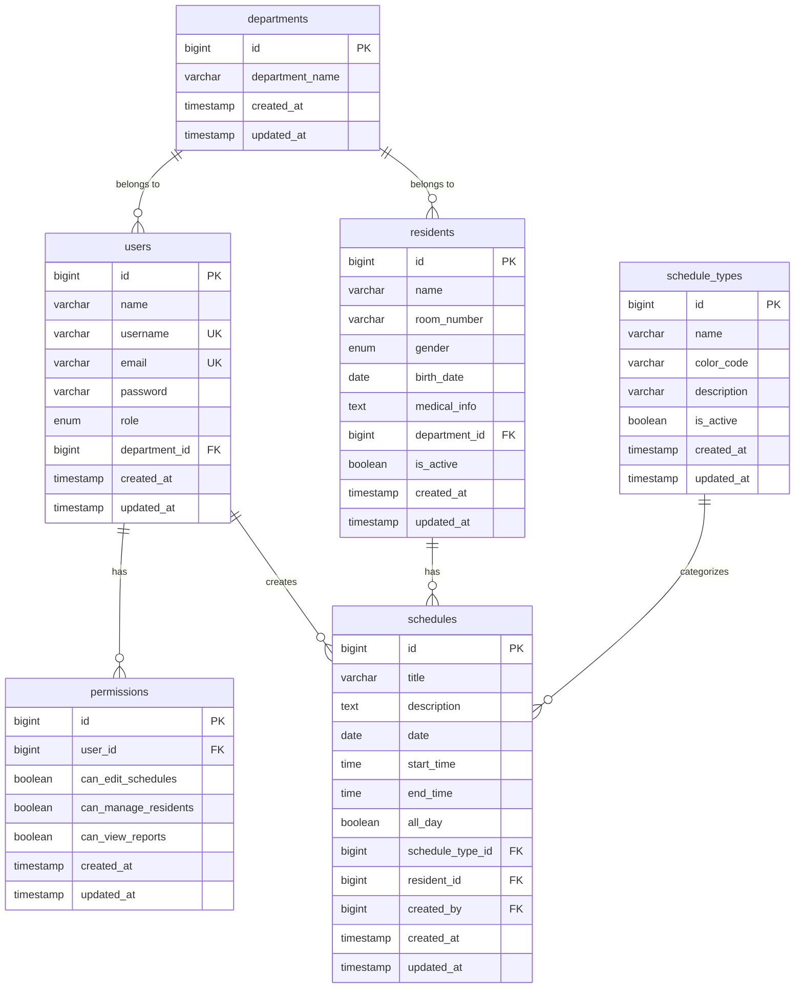

# 🗃️ データベース設計

このドキュメントでは、介護施設カレンダーアプリのデータベース設計について説明します。

## 📊 データベース構成概要

アプリケーションは以下の主要テーブルで構成されています：

```
住民管理系
├── departments (部署)
├── users (職員)
├── residents (住民)
└── permissions (権限)

スケジュール管理系
├── schedule_types (スケジュール種別)
├── calendar_dates (カレンダー日付)
└── schedules (スケジュール)
```

## 🏗️ テーブル設計詳細

### departments（部署テーブル）

介護施設の部署情報を管理します。

| カラム名 | 型 | 制約 | 説明 |
|---------|---|------|------|
| id | bigint | PK, AI | 部署ID |
| department_name | varchar(100) | NOT NULL, INDEX | 部署名 |
| created_at | timestamp | | 作成日時 |
| updated_at | timestamp | | 更新日時 |

**リレーション**:
- `hasMany` users（職員）
- `hasMany` residents（住民）

### users（職員テーブル）

Laravel Breezeベースの認証テーブルを拡張したものです。

| カラム名 | 型 | 制約 | 説明 |
|---------|---|------|------|
| id | bigint | PK, AI | ユーザーID |
| name | varchar(255) | NOT NULL | 職員氏名 |
| username | varchar(50) | UNIQUE, INDEX | ログインID |
| email | varchar(255) | NULLABLE, UNIQUE | メールアドレス |
| password | varchar(255) | NOT NULL | パスワードハッシュ |
| role | enum | DEFAULT 'staff' | 権限レベル |
| department_id | bigint | FK, INDEX | 所属部署ID |
| email_verified_at | timestamp | NULLABLE | メール確認日時 |
| remember_token | varchar(100) | NULLABLE | ログイン保持トークン |
| created_at | timestamp | | 作成日時 |
| updated_at | timestamp | | 更新日時 |

**roleの値**:
- `admin`: 管理者（全権限）
- `staff`: 一般職員（通常権限）
- `viewer`: 閲覧者（読み取り専用）

**リレーション**:
- `belongsTo` department（部署）
- `hasMany` schedules（作成したスケジュール）
- `hasMany` permissions（権限設定）

### residents（住民テーブル）

介護施設の入居住民情報を管理します。

| カラム名 | 型 | 制約 | 説明 |
|---------|---|------|------|
| id | bigint | PK, AI | 住民ID |
| name | varchar(100) | NOT NULL, INDEX | 住民氏名 |
| room_number | varchar(20) | NULLABLE, INDEX | 部屋番号 |
| gender | enum | NULLABLE | 性別 |
| birth_date | date | NULLABLE | 生年月日 |
| medical_info | text | NULLABLE | 医療情報・注意事項 |
| department_id | bigint | FK | 所属部署ID |
| is_active | boolean | DEFAULT true, INDEX | 入居中フラグ |
| created_at | timestamp | | 作成日時 |
| updated_at | timestamp | | 更新日時 |

**genderの値**:
- `male`: 男性
- `female`: 女性
- `other`: その他

**リレーション**:
- `belongsTo` department（部署）
- `hasMany` schedules（関連スケジュール）

### schedule_types（スケジュール種別テーブル）

スケジュールの分類を管理します。

| カラム名 | 型 | 制約 | 説明 |
|---------|---|------|------|
| id | bigint | PK, AI | 種別ID |
| name | varchar(50) | NOT NULL, INDEX | 種別名 |
| color_code | varchar(7) | DEFAULT '#3B82F6' | 表示色（16進数） |
| description | varchar(255) | NULLABLE | 説明 |
| is_active | boolean | DEFAULT true, INDEX | 有効フラグ |
| created_at | timestamp | | 作成日時 |
| updated_at | timestamp | | 更新日時 |

**デフォルトデータ**:
- 入浴（#3B82F6 - 青）
- 医療行為（#EF4444 - 赤）
- リハビリ（#10B981 - 緑）
- レクリエーション（#F59E0B - 黄）
- 面会（#8B5CF6 - 紫）

**リレーション**:
- `hasMany` schedules（このタイプのスケジュール）

### schedules（スケジュールテーブル）

実際のスケジュール情報を管理するメインテーブルです。

| カラム名 | 型 | 制約 | 説明 |
|---------|---|------|------|
| id | bigint | PK, AI | スケジュールID |
| title | varchar(200) | NOT NULL | スケジュールタイトル |
| description | text | NULLABLE | 詳細説明 |
| date | date | NOT NULL, INDEX | 実施日 |
| start_time | time | NULLABLE | 開始時刻 |
| end_time | time | NULLABLE | 終了時刻 |
| all_day | boolean | DEFAULT false | 終日フラグ |
| schedule_type_id | bigint | FK | スケジュール種別ID |
| resident_id | bigint | FK, NULLABLE | 対象住民ID（NULL=全体対象） |
| created_by | bigint | FK | 作成者（職員）ID |
| created_at | timestamp | | 作成日時 |
| updated_at | timestamp | | 更新日時 |

**複合インデックス**:
- `(date, schedule_type_id)`: 日付・種別での検索最適化
- `(resident_id, date)`: 住民別日付検索最適化

**リレーション**:
- `belongsTo` scheduleType（スケジュール種別）
- `belongsTo` resident（対象住民）
- `belongsTo` creator（作成者）

### permissions（権限テーブル）

職員の詳細権限設定を管理します。

| カラム名 | 型 | 制約 | 説明 |
|---------|---|------|------|
| id | bigint | PK, AI | 権限ID |
| user_id | bigint | FK, CASCADE | 対象職員ID |
| can_edit_schedules | boolean | DEFAULT false | スケジュール編集権限 |
| can_manage_residents | boolean | DEFAULT false | 住民管理権限 |
| can_view_reports | boolean | DEFAULT false | レポート閲覧権限 |
| created_at | timestamp | | 作成日時 |
| updated_at | timestamp | | 更新日時 |

**リレーション**:
- `belongsTo` user（対象職員）

### calendar_dates（カレンダー日付テーブル）

カレンダー表示用の日付マスタデータです。

| カラム名 | 型 | 制約 | 説明 |
|---------|---|------|------|
| id | bigint | PK, AI | 日付ID |
| calendar_date | date | UNIQUE, INDEX | 日付 |
| day_of_week | varchar(10) | | 曜日 |
| is_holiday | boolean | DEFAULT false, INDEX | 祝日フラグ |
| holiday_name | varchar(255) | NULLABLE | 祝日名 |
| is_weekend | boolean | DEFAULT false | 週末フラグ |
| created_at | timestamp | | 作成日時 |
| updated_at | timestamp | | 更新日時 |

## 🔗 リレーション図



## 📝 マイグレーション実行順序

テーブル間の依存関係により、以下の順序でマイグレーションを実行する必要があります：

```bash
# 1. 基盤テーブル
./vendor/bin/sail artisan migrate --path=database/migrations/2025_07_03_230819_create_departments_table.php

# 2. ユーザー関連
./vendor/bin/sail artisan migrate --path=database/migrations/2025_07_04_235933_modify_users_table_for_staff.php

# 3. 住民テーブル
./vendor/bin/sail artisan migrate --path=database/migrations/2025_07_03_231348_create_residents_table.php

# 4. スケジュール関連
./vendor/bin/sail artisan migrate --path=database/migrations/2025_07_03_231525_create_schedule_types_table.php
./vendor/bin/sail artisan migrate --path=database/migrations/2025_07_03_231728_create_calendar_dates_table.php
./vendor/bin/sail artisan migrate --path=database/migrations/2025_07_03_231839_create_schedules_table.php

# 5. 権限テーブル
./vendor/bin/sail artisan migrate --path=database/migrations/2025_07_03_231951_create_permissions_table.php

# または、全体実行
./vendor/bin/sail artisan migrate
```

## 🌱 初期データの投入

### シーダー実行順序

```bash
# 1. 部署データ
./vendor/bin/sail artisan db:seed --class=DepartmentSeeder

# 2. 職員データ
./vendor/bin/sail artisan db:seed --class=UserSeeder

# 3. 住民データ
./vendor/bin/sail artisan db:seed --class=ResidentSeeder

# 4. スケジュール種別データ
./vendor/bin/sail artisan db:seed --class=ScheduleTypeSeeder

# 5. スケジュールサンプルデータ
./vendor/bin/sail artisan db:seed --class=ScheduleSeeder

# または、全体実行
./vendor/bin/sail artisan db:seed
```

### デフォルトデータ確認

```bash
# データ投入後の確認
./vendor/bin/sail artisan tinker

# 部署数確認
>> App\Models\Department::count()

# 職員数確認
>> App\Models\User::count()

# 住民数確認
>> App\Models\Resident::count()

# スケジュール数確認
>> App\Models\Schedule::count()

# 今日のスケジュール確認
>> App\Models\Schedule::whereDate('date', today())->count()
```

## 🎯 クエリ最適化

### よく使用されるクエリパターン

```php
// 今日のスケジュール（住民・種別込み）
Schedule::with(['resident', 'scheduleType', 'creator'])
    ->whereDate('date', today())
    ->orderBy('start_time')
    ->get();

// 特定住民の今月のスケジュール
Schedule::with('scheduleType')
    ->where('resident_id', $residentId)
    ->whereBetween('date', [
        now()->startOfMonth(),
        now()->endOfMonth()
    ])
    ->orderBy('date')
    ->get();

// 部署別アクティブ住民数
Resident::where('department_id', $deptId)
    ->where('is_active', true)
    ->count();

// 月別スケジュール種別集計
Schedule::selectRaw('schedule_type_id, COUNT(*) as count')
    ->with('scheduleType')
    ->whereBetween('date', [$startDate, $endDate])
    ->groupBy('schedule_type_id')
    ->get();
```

### インデックス設計の考慮点

1. **検索頻度の高いカラム**にインデックスを設定
   - `schedules.date`: 日付検索
   - `residents.is_active`: アクティブ住民フィルタ
   - `users.username`: ログイン認証

2. **複合インデックス**で範囲検索を最適化
   - `(date, schedule_type_id)`: 日付・種別での絞り込み
   - `(resident_id, date)`: 住民別のスケジュール検索

3. **外部キー制約**でデータ整合性を保証
   - すべての参照関係に適切な外部キー制約を設定

## 🔧 データベースメンテナンス

### 定期的な確認項目

```bash
# データベースサイズ確認
./vendor/bin/sail mysql -e "
SELECT 
    table_name,
    ROUND(((data_length + index_length) / 1024 / 1024), 2) AS 'Size (MB)'
FROM information_schema.tables 
WHERE table_schema = 'care_facility_calendar'
ORDER BY (data_length + index_length) DESC;
"

# 最も大きなテーブルの確認
./vendor/bin/sail artisan db:show --counts

# インデックス使用状況の確認
./vendor/bin/sail mysql -e "SHOW INDEX FROM schedules;"
```

### バックアップとリストア

```bash
# データベースバックアップ
./vendor/bin/sail exec mysql mysqldump -u sail -ppassword care_facility_calendar > backup.sql

# データベースリストア
./vendor/bin/sail exec -T mysql mysql -u sail -ppassword care_facility_calendar < backup.sql

# マイグレーションのリセット
./vendor/bin/sail artisan migrate:fresh --seed
```

## 📚 関連ドキュメント

- [シーダーとテストデータ](seeding.md) - データ生成の詳細
- [テスト実行方法](testing.md) - データベーステストの書き方
- [認証システム](../features/auth.md) - users テーブルの活用方法

---

**💡 設計のポイント**: 
- 介護施設特有の要件（住民の医療情報、部屋番号管理など）を考慮
- スケジュールの柔軟な検索・集計に対応したインデックス設計
- 将来的な機能拡張（通知、レポート機能など）を見越したテーブル構造